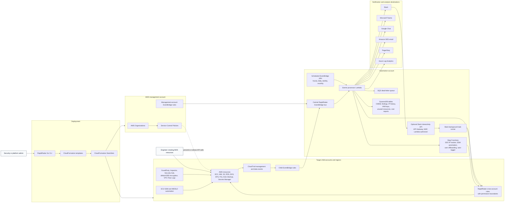

# Architecture

RapidRadar is an event-driven AWS organization security platform. It deploys preventive controls, routes account activity to a central automation account, evaluates each event, records security and ownership state, and sends notifications or remediation actions.

## How The System Works

### 1. Deployment Layer

The [Go CLI](../core/main.go) reads YAML configuration from [core/env](../core/env), validates it, then deploys CloudFormation stacks and StackSets. The management account, automation account, and child accounts each receive the resources they need for event routing, security services, roles, and remediation.

The deployment model is organization-aware. It can target AWS account IDs, organizational units, or the organization root, while excluding specific accounts.

### 2. Preventive Controls

RapidRadar is not only an alerting tool. It uses preventive controls where AWS can enforce policy before a risky resource exists.

Service Control Policies can block launches or creations that violate organization rules, including missing required tags, EC2 without IMDSv2, EC2 with public IPs, unencrypted EBS volumes, load balancers, Elastic IP allocation, unencrypted RDS, IAM users, and public EBS snapshots. Bypass tags can be configured for approved exceptions, and bypass usage can still alert.

Security foundation features such as GuardDuty, Inspector, Security Hub, default EBS encryption, CloudTrail, and VPC Flow Logs can be enabled across accounts and regions.

### 3. Event Collection

Child accounts forward selected CloudTrail and service events to the central RapidRadar EventBridge bus. Events include EC2, IAM, S3, RDS, EKS, EFS, FSx, ELB, Backup, Secrets Manager, SSO, Organizations, Control Tower, sign-in events, GuardDuty findings, and scheduled maintenance jobs.

This creates one central decision point while keeping account-specific enforcement and remediation scoped through child-account roles.

### 4. Event Processing

The central events processor Lambda inspects each event, identifies the service and action, enriches it with account, region, user, IP address, and resource context, then calls a service-specific handler.

Handlers decide whether to:

- record resource state in DynamoDB;
- send an engineer-facing or security-admin-facing notification;
- create a PagerDuty incident;
- send findings to Azure Log Analytics;
- start a Step Function workflow;
- remediate immediately;
- schedule a follow-up remediation or reminder.

### 5. State And Reporting

DynamoDB stores the operational memory of the system: active resources, deleted resources, security group findings, IAM users and access keys, S3 bucket exposure, root and IAM logins, SSO IP history, unused resources, remediated resources, and user cost reports.

Scheduled jobs use this state to send reminders, detect stale resources, generate daily/weekly/monthly cost reports, and follow up on unresolved findings.

### 6. Remediation

Remediation runs through scoped cross-account roles in target accounts. Examples include closing public security group rules, making public AMIs or snapshots private, re-enabling S3 account public access block, deactivating stale access keys, deleting unused resources, and attaching required EC2 SSM policies.

Some remediation can be automatic. Other actions are exposed through Slack so engineers can acknowledge, tag, remediate, delete, or escalate findings.

### 7. Human-In-The-Loop Slack Actions

When Slack interactivity is enabled, RapidRadar deploys API Gateway, WAF, a request verifier, a response handler, and a background task runner. Slack actions are validated, converted into a small action payload, then executed asynchronously by the background Lambda through the Slack-specific cross-account role.

This keeps the user experience simple while keeping destructive AWS actions behind role boundaries and target-account validation.

### 8. Trust Boundaries

The most important boundary is between the automation account and child accounts. RapidRadar centralizes decision-making but uses account-local roles with permission boundaries for resource changes. The central event bus accepts events from the AWS Organization, and remediation roles should be reviewed regularly as the supported action set changes.

Notification systems and external analysis destinations are outbound integrations. Secrets for Slack, PagerDuty, Azure, and Tailscale should live in AWS Secrets Manager or SSM Parameter Store, with YAML files containing only parameter or secret names.
